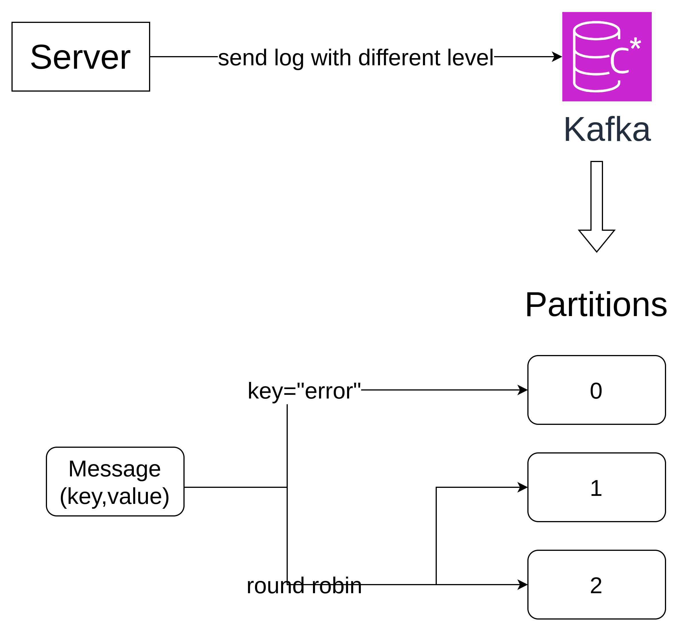

# golang-kafka-with-custom-partitioner

This repository is implementation how to use go-kafka library to setup custom partitioner to consumer specific log from kafka

## partition concept



## setup kafka with docker

```yaml
services:
  kafka:
    image: bitnami/kafka:latest
    ports:
      - '9092:9092'
      - '9093:9093'
    environment:
      - KAFKA_CFG_NODE_ID=0
      - KAFKA_CFG_PROCESS_ROLES=controller,broker
      - KAFKA_CFG_CONTROLLER_QUORUM_VOTERS=0@kafka:9093
      - KAFKA_CFG_LISTENERS=PLAINTEXT://kafka:9092,CONTROLLER://kafka:9093
      - KAFKA_CFG_ADVERTISED_LISTENERS=PLAINTEXT://localhost:9092
      - KAFKA_CFG_CONTROLLER_LISTENER_NAMES=CONTROLLER
      - KAFKA_CFG_LISTENER_SECURITY_PROTOCOL_MAP=CONTROLLER:PLAINTEXT,PLAINTEXT:PLAINTEXT
```

## create partition in producer

```golang
type CustomBalancer struct {
	// use the inbuilt round robin balancer
	baseBalancer kafka.RoundRobin
}

func (b *CustomBalancer) Balance(msg kafka.Message, partitions ...int) (partition int) {
	// only error logs are sent to first partition
	if string(msg.Key) == "error" {
		return 0
	}
	// everything else get round robined to other partition
	return b.baseBalancer.Balance(msg, partitions[1:]...)
}
```

### setup topic

```golang
ctx := context.Background()
	topic := "logs"
	conn, err := kafka.DialContext(ctx, "tcp", "localhost:9092")
	if err != nil {
		panic(err)
	}
	err = conn.CreateTopics(kafka.TopicConfig{
		Topic:             topic,
		NumPartitions:     3,
		ReplicationFactor: 1,
	})
	if err != nil {
		panic(err)
	}
```
### setup writer

```golang
// 2 create writer
	writer := kafka.NewWriter(kafka.WriterConfig{
		Brokers:  []string{"localhost:9092"},
		Topic:    topic,
		Balancer: &CustomBalancer{},
	})
	err = writer.WriteMessages(ctx,
		kafka.Message{
			Key:   []byte("error"),
			Value: []byte("some error happend in the application"),
		},
		kafka.Message{
			Key:   []byte("warn"),
			Value: []byte("this is a warning"),
		},
	)
	if err != nil {
		panic(err)
	}
	log.Println("written messages successfully")
```

### setup reader

```golang
errReader := kafka.NewReader(kafka.ReaderConfig{
		Brokers:   []string{"localhost:9092"},
		Topic:     topic,
		Partition: 0, // read only error logs
	})
	msgReader := kafka.NewReader(kafka.ReaderConfig{
		Brokers:   []string{"localhost:9092"},
		Topic:     topic,
		Partition: 1,
	})
```
## how to run

1. setup kafka with docker compose
```shell
docker compose up -d
```

2. run producer to create topic and message
```shell
make run-producer
```

3. run consumer to read message from topic
```shell
make run-consumer
```